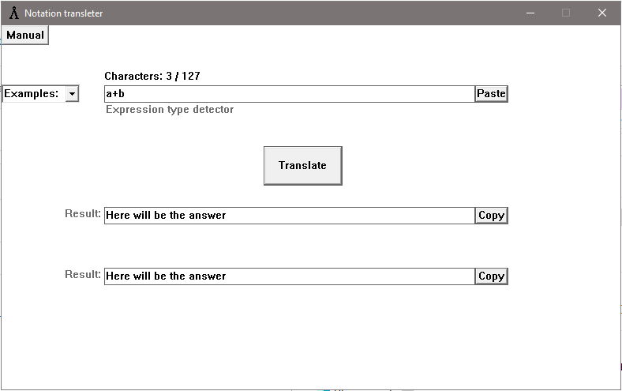
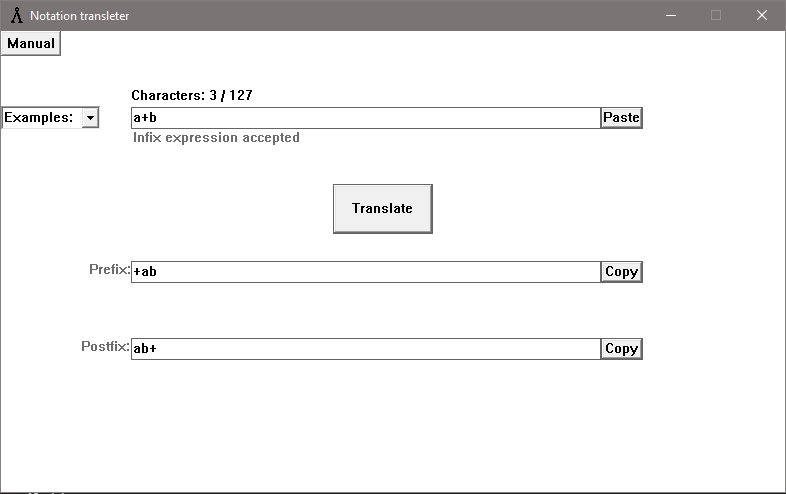
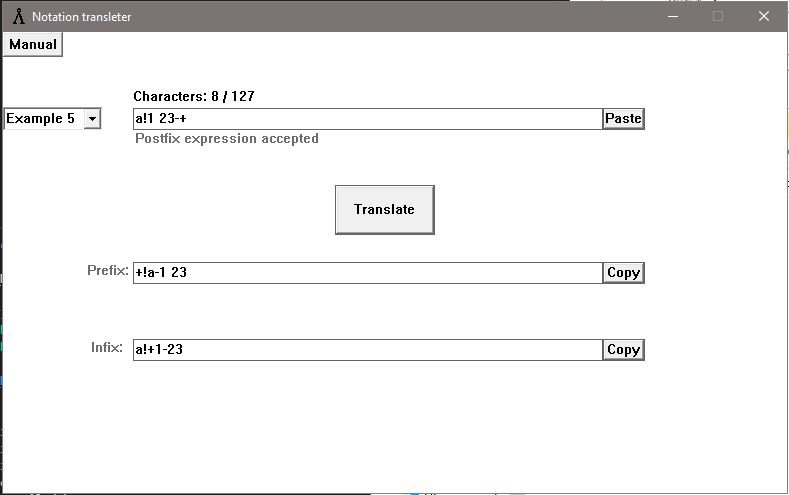
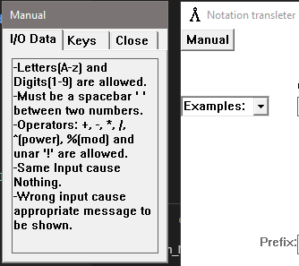
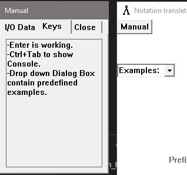

> Note: `Close` tab is turned (for experiment) into a _hiding button_ for a _child window_.
>> Teach Story: Initially mentioned `Manual's` _tabs_ were stored as _C-array_, but... As you see... There are only 2 out of 3 tabs are ordinary. And I forgot that additional _check-logic_ should be added for this case.
As a result, first(topmost) `Text input box` disappeared on each `Close` tab switch in _Realease_ build version.
Probably u understand why ;), or at least guessing why.
After this _lesson_ I'm using STL containers whenever possible :)
Since `asserts` aid very much :thumbsup:
